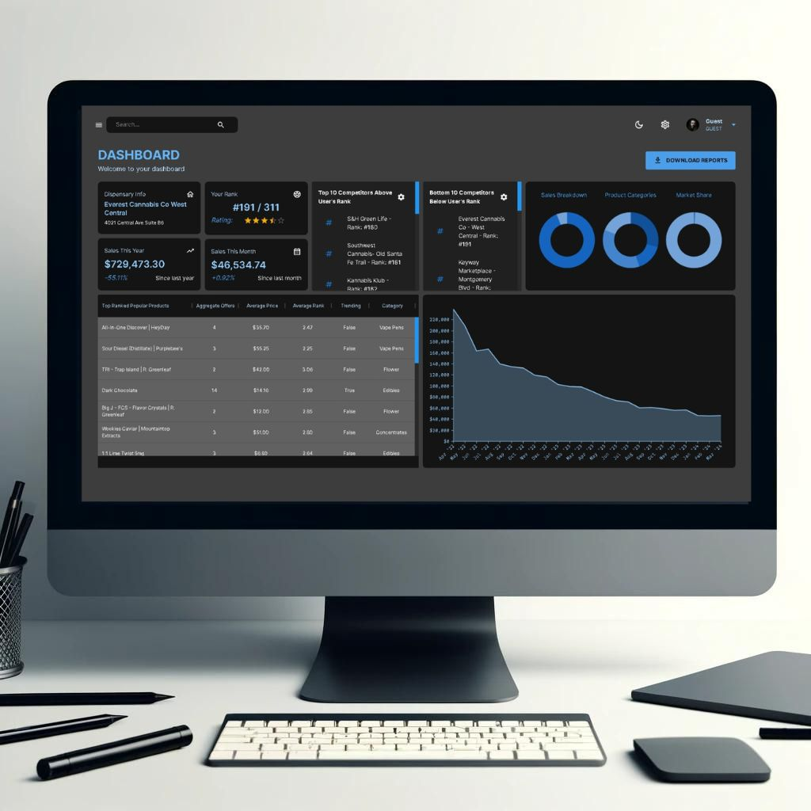
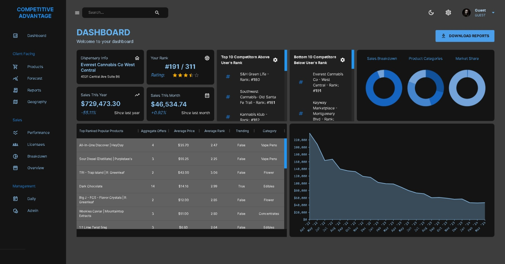
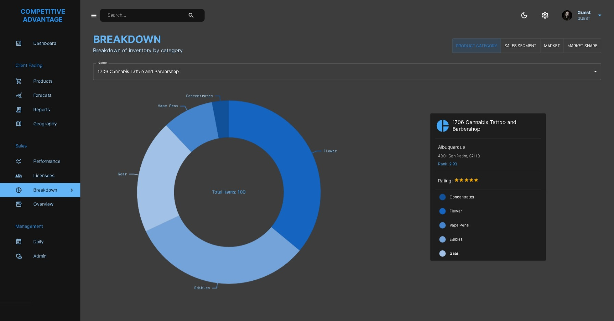
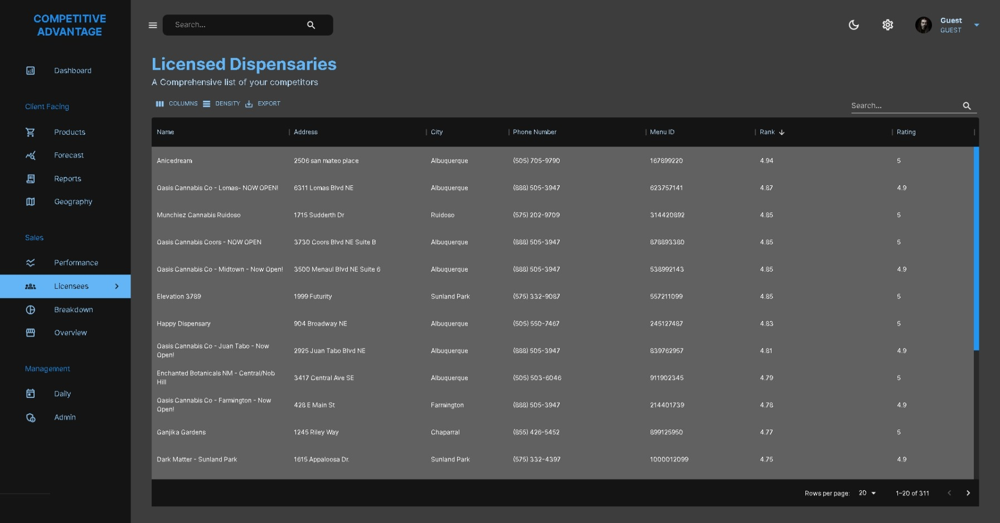
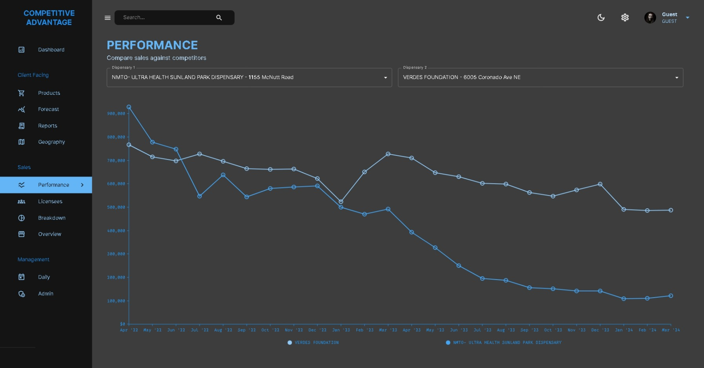
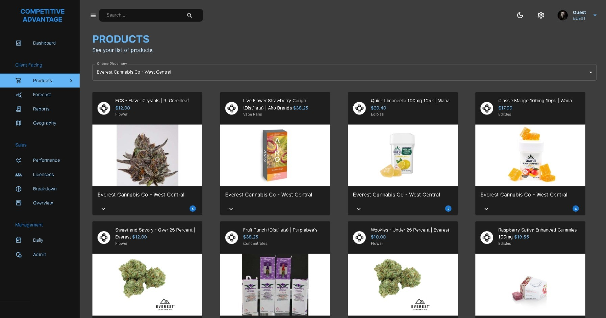
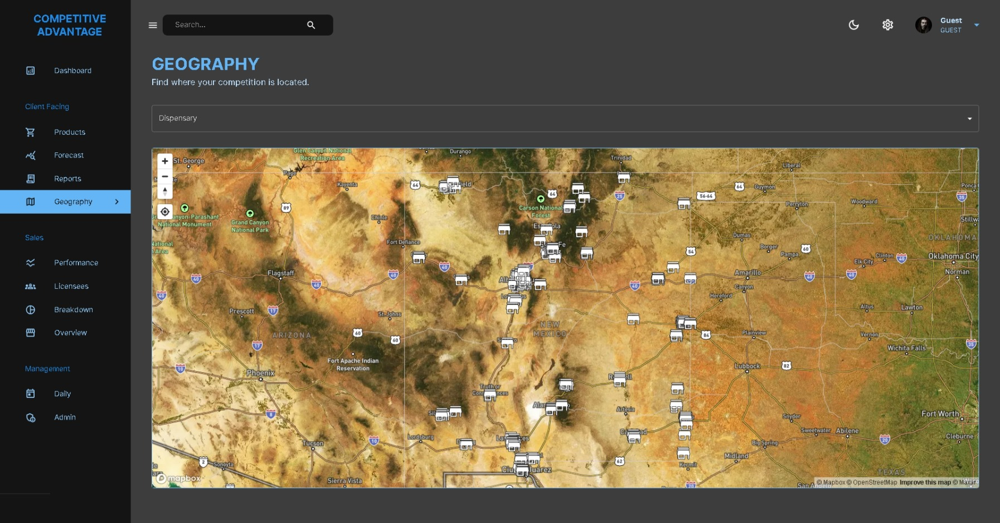

# A Retail Analytics Dashboard for the New Mexico Cannabis Industry


## Overview
The Retail Analytics Dashboard is a comprehensive tool designed to provide dispensaries in New Mexico with actionable insights through interactive data visualizations. It focuses on competitive pricing, sales trends, and market share analysis, leveraging advanced data visualization and state management techniques.

<div align="center">


[](https://github.com/DigitalHerencia/NM-Cannabis-Analytics/network)
[](https://github.com/DigitalHerencia/NM-Cannabis-Analytics/stargazers)


[](https://github.com/DigitalHerencia/NM-Cannabis-Analytics/issues)
[](http://perso.crans.org/besson/LICENSE.html)

</div>

## Table of Contents
1. [Features](#features)
2. [Technology Stack](#technology-stack)
3. [Installation](#installation)
4. [Usage](#usage)
5. [Screenshots](#screenshots)
6. [Contributing](#contributing)
7. [License](#license)
8. [Contact](#contact)

## Features
### Menu Comparison Feature
- 📋 **Description:** Allows dispensaries to compare their product prices against competitors.
- 🖥️ **Technology:** Heads-up display technology.
- 🛒 **Implementation:** Utilizes RESTful API to fetch competitive pricing data and display comparisons in a user-friendly format.

### Sales Data Visualization
- 🗃️ **Description:** Presents time-series analysis of sales data to aid trend identification and forecasting.
- 📊 **Technology:** Nivo charts.
- 📈 **Implementation:** Uses Nivo’s line charts to depict sales trends over time, with data fetched from the backend via RESTful APIs.

### Market Share Analysis
- 📖 **Description:** Analyzes and displays market share by zip code using GIS data.
- 🗺️ **Technology:** Mapbox maps, pie charts.
- 📍 **Implementation:** Integrates Mapbox for geographical visualization and Nivo pie charts for market share representation. Data is processed and visualized based on zip code analysis.

> [!TIP]
> Use your own MongoDB connection string in the `.env` file and load in your custom data.

## Technology Stack



<div align="center">
  <div style="display: flex; justify-content: center; align-items: center; flex-wrap: wrap; gap: 10px;">

[](https://reactjs.org/)
[](https://nodejs.org/)
[](https://www.mongodb.com/)
[](https://expressjs.com/)

</div>
</div>

<div align="center">
  <div style="display: flex; justify-content: center; align-items: center; flex-wrap: wrap; gap: 10px;">

[](https://mui.com/)
[](https://redux.js.org/)
[](https://jwt.io/)

</div>
</div>

<div align="center">
  <div style="display: flex; justify-content: center; align-items: center; flex-wrap: wrap; gap: 10px;">


[](https://developer.mozilla.org/en-US/docs/Web/JavaScript)
[](https://reactjs.org/docs/introducing-jsx.html)


</div>
</div>

- **Frontend:** React, Material-UI
- **State Management:** Redux
- **Backend:** Node.js, Express.js
- **Database:** MongoDB
- **Authentication:** JWT (JSON Web Tokens)
- **Data Visualization:** Nivo, Mapbox

## Installation
To install and run this project locally:

1. Clone the repository:

   ```sh
   git clone https://github.com/yourusername/retail-analytics-dashboard.git
   ```
2. Navigate to the project directory:

    ```sh
    cd retail-analytics-dashboard
    ```
3. Install frontend dependencies:

    ```sh
    cd client
    npm install
    ```
4. Install backend dependencies:

    ```sh
    cd ../server
    npm install
    ```
5. Set up environment variables by creating a .env file in the root of the server directory with the following content:

    ```makefile
    MONGODB_URI=your_mongodb_uri
    JWT_SECRET=your_jwt_secret
    ```

> [!NOTE]  
> Make sure to install all dependencies and create the `.env` file with the required environment variables.

## Usage
To start the development server, run the following commands:

1. Start the frontend:
    ```sh
    cd client
    npm start
    ```
2. Start the backend:
    ```sh
    cd ../server
    npm start
    ```

## Screenshots

  <div align="center">
  <figure>
    
    <figcaption> </figcaption>
  </figure>
  </div>

  <br>
  
  <div align="center">
  <div style="display: flex;">

  <figure>
    
    <figcaption>&nbsp;&nbsp;&nbsp;&nbsp;&nbsp;&nbsp;</figcaption>
  </figure>
  <figure>
    
    <figcaption>  </figcaption>
  </figure>

  </div>
  </div>

  <br>
  
  <div align="center">
  <div style="display: flex;">

  <figure>
    
    <figcaption>&nbsp;&nbsp;&nbsp;&nbsp;&nbsp;&nbsp;</figcaption>
  </figure>
  <figure>
    
    <figcaption>   </figcaption>
  </figure>

  </div>
  </div>

<br>

<div align="center">
  <figure>
    
    <figcaption> </figcaption>
  </figure>
</div>

## Contributing
Contributions are welcome! Please see our contributing guidelines before submitting a pull request.

## License
This project is licensed under the [GNU General Public License version 3.0](https://www.gnu.org/licenses/agpl-3.0.en.html).

## Contact
For any inquiries or feedback, please reach out to us at DigitalHerencia@Outlook.com


